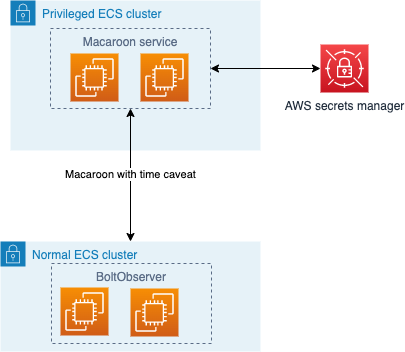

# Lightning Vault

Lightning Vault is a secure secrets solution for storing lightning node authentication tokens in AWS environment. Purpose of this is to limit the fallout of potential credential leak or security incident and apply rolling credential principles to lightning network infrastructure.

By design original secret can never be retrieved, you can only request a time-restricted version of it from the service. This way your applications can interact with your nodes but always use expiring credentials.

Supports [LND](https://github.com/lightningnetwork/lnd/) (macaroons) and [CoreLightning](https://github.com/ElementsProject/lightning) (runes).

## Requirements

IAM permissions:

The service uses AWS SecretsManager internally for storing the original secret.
It needs following IAM permissions:

```
{
  "Action": "secretsmanager:ListSecrets",
  "Effect": "Allow",
  "Resource": "*"
},
{
  "Action": [
    "secretsmanager:GetResourcePolicy",
    "secretsmanager:GetSecretValue",
    "secretsmanager:DescribeSecret",
    "secretsmanager:ListSecretVersionIds",
    "secretsmanager:PutSecret",
    "secretsmanager:UpdateSecret",
    "secretsmanager:CreateSecret"
  ],
  "Effect": "Allow",
  "Resource": [
      "arn:aws:secretsmanager:us-east-1:123456789012:secret:stagingmacaroon_*"
  ]
}
```

(Note that it needs to list all secrets, but you can restrict read and write access to only vault specific secrets.)
Name of the secret will always start with "<environment>macaroon_". ARN from the example
`arn:aws:secretsmanager:us-east-1:123456789012:secret:stagingmacaroon_*` includes region (`us-east-1`) and
account id (`123456789012`) which you need to customize for your needs. The part after the last colon (`stagingmacaroon_*`) means
all secrets with names starting with `stagingmacaroon_`.

Vault will know the current environment through `ENV` environment variable. It can be any alphanumeric string. There is just one special value `local`. On local environment
Vault will store secrets only in memory and not persist them to SecretsManager.

The most convenient option is to use [IAM Instance Profiles](https://docs.aws.amazon.com/IAM/latest/UserGuide/id_roles_use_switch-role-ec2_instance-profiles.html) but you could also create
an IAM user and then add access keys (`AWS_ACCESS_KEY_ID` and `AWS_SECRET_ACCESS_KEY` environment variables).

## Configuration

Vault is configured through environment variables.

| Variable         | Description |
| ---------------- | ----------- |
| ENV              | env name with which all stored credentials are starting       |
| READ_API_KEY_1D  | list of users that can request credentials valid for 24h        |
| READ_API_KEY_1H  | list of users that can request credentials valid for 1h      |
| READ_API_KEY_10M | list of users that can request credentials valid for 1h        |
| WRITE_API_KEY    | list of users that can input new credentials            |

 For examples check [Usage](https://github.com/bolt-observer/lightning-vault/blob/main/README.md#usage)

## Authentication to Vault

There are multiple authentecation options your applications and services can use to access Lightning Vault.

### HTTP Basic Auth

They authenticate through HTTP Basic authentication with a username and password. Since credentials are transmitted in clear-text, you
need a secure transport channel. Lightning Vault itself does not terminate TLS connections, it is meant to be behind a load-balancer or reverse proxy that handles that.

### AWS Presigned Requests
Another authentication is `X-Amazon-Presigned-GetCalleridentity` HTTP header. This way callers locally sign a request for
Amazon STS service and Lightning Vault then takes this serialized request and executes it on behalf of the requestor. If it succeeds that proves their identity.
Read more about AWS Signed Requests authentication method [here](https://ahermosilla.com/cloud/2020/11/17/leveraging-aws-signed-requests.html).

The "username" Vault infers via this method is complete ARN. For example:
`arn:aws:sts::123456789012:assumed-role/some-machine-role/i-xxxxxxxxxxxxxxxxx`
if you used IAM instance profile

or:

`arn:aws:sts::123456789012:assumed-role/role/user`
if you were using AWS SSO.

With this authentication option a wildcard match against username is performed.
Setting username to `arn:aws:sts::123456789012:assumed-role/some-machine-role/*` will grant permissions
to any instance using `some-machine-role`.

Caller just provides `X-Amazon-Presigned-Getcalleridentity` value and no username or password (request should not even include HTTP Authorization header).

In the configuration instead of a password you use a special placeholder value `$iam`. It is chosen in such a way that it is is invalid as a password for any other method.
This prevents somebody authenticating via HTTP Basic authentication with literal username `arn:aws:sts::123456789012:assumed-role/some-machine-role/*` if at some time this entry got interpreted as a username and password.

### Access Roles

There are 4 different permission levels ("roles") which are also configured through enviroment variables:
* READ_API_KEY_10M can obtain secrets valid for 10 minutes
* READ_API_KEY_1H can obtain secrets valid for 1 hour
* READ_API_KEY_1D can obtain secrets valid for 1 day
* WRITE_API_KEY can write (or overwrite and thus effectively invalidate) stored secrets

each entry (value of the environment variable) is a list of users seperated with a comma.
Roles `READ_API_KEY_10M`, `READ_API_KEY_1H` and `READ_API_KEY_1D` are mutually exclusive. So if you have user `user1` in `READ_API_KEY_10M` `user1` must not be in
`READ_API_KEY_1D` too for instance.

An entry has 3 possible authentication ways:
* `user|pass` - you can authenticate via HTTP Basic authentication with username `user` and password `pass`

* `user|$2a$...` - you can authenticate via HTTP Basic authentication  with username `user` and the password that has one-way hash `$2a$...` (bcrypt)
This methods allows you to leave configuration in plain-text and not leak credentials.

* `glob|$iam` - you can authenticate via IAM authentication, you need to set `X-Amazon-Presigned-Getcalleridentity` HTTP header to the presigned query string for STS/GetCallerIdentity call.
Glob can contain wildcards `?` (meaning any one character) and `*` (meaning zero or more characters) and is matched against complete ARN of the identity from GetCallerIdentity.

## Deployment
Vault is meant to be deployed as a standalne service with priviledged access to SecretManager. Your applications should have limited API access to Vault through API.



## API

Vault supports following operations:

* Adding a macaroon or rune

  This is done with HTTP POST request to `/put/` endpoint. Another request to same endpoint will overwrite previously stored data. Initial creation of a macaroon returns HTTP 201 (Created) response
  while subsequent (over)writes will return HTTP 200. For this operation `write` permissions are required. As described later this includes the verification part which will actually try to connect to
  the lightning node (so `endpoint` needs to be reachable from Vault).

  JSON payload looks like this:

  ```
  {
    "pubkey": "0367fa307a6e0ce29efadc4f7c4d1109ee689aa1e7bd442afd7270919f9e28c3b7",
    "macaroon_hex": "...",
    "certificate_base64": "LS0tLS1CRUdJTiBDRVJUSUZJQ0FURS0tLS0tCk1JSUNKakNDQWN5Z0F3SUJBZ0lRUmU4QzhCcURubEF3b0VxRjdMRTVGREFLQmdncWhrak9QUVFEQWpBeE1SOHcKSFFZRFZRUUtFeFpzYm1RZ1lYVjBiMmRsYm1WeVlYUmxaQ0JqWlhKME1RNHdEQVlEVlFRREV3VmhiR2xqWlRBZQpGdzB5TXpBeE1ESXhOVE0xTXpsYUZ3MHlOREF5TWpjeE5UTTFNemxhTURFeEh6QWRCZ05WQkFvVEZteHVaQ0JoCmRYUnZaMlZ1WlhKaGRHVmtJR05sY25ReERqQU1CZ05WQkFNVEJXRnNhV05sTUZrd0V3WUhLb1pJemowQ0FRWUkKS29aSXpqMERBUWNEUWdBRXlKaHRYWk1NT0NQYzYxWmlISmVyKzdHUm9HalFzcWtNcjdvQVVjNnZsZC9JNDl2SwpHR01mRjhMcDhTSm1jNlJVOHQxN3FEZFhyUmZMbTdLSjB0eDBkcU9CeFRDQndqQU9CZ05WSFE4QkFmOEVCQU1DCkFxUXdFd1lEVlIwbEJBd3dDZ1lJS3dZQkJRVUhBd0V3RHdZRFZSMFRBUUgvQkFVd0F3RUIvekFkQmdOVkhRNEUKRmdRVU5BUW5BYVBNOStrZEpxMXdud2FtbldpY1d1SXdhd1lEVlIwUkJHUXdZb0lGWVd4cFkyV0NDV3h2WTJGcwphRzl6ZElJRllXeHBZMldDRG5CdmJHRnlMVzQyTFdGc2FXTmxnZ1IxYm1sNGdncDFibWw0Y0dGamEyVjBnZ2RpCmRXWmpiMjV1aHdSL0FBQUJoeEFBQUFBQUFBQUFBQUFBQUFBQUFBQUJod1NzR0FBQ01Bb0dDQ3FHU000OUJBTUMKQTBnQU1FVUNJUUQ2dElDMVdTWFRWNkpuSzVlN3FkdDRBVHp2Q0ZHUldPTmp2T29tUUdScXB3SWdiR1ZJWFVPbgpHamlUdTZ5MXVMT1pRS0VPTnB1MXZkYUNKejVpanNRdlVndz0KLS0tLS1FTkQgQ0VSVElGSUNBVEUtLS0tLQo=",
    "endpoint": "127.0.0.1:10009",
  }
  ```

  `pubkey` is the public key of the node, `macaroon_hex` is the serialized version of the macaroon as a hex string (you can obtain it using ```xxd -p -c 10000 file.macaroon```), `certificate_base64` is the X.509 certificate as a base64 string (obtained using ```base64 tls.cert | tr -d "\n"```and `endpoint` is the endpoint of the lightning node.

  When adding a rune the name of the field is still `macaroon_hex`. The value is base64 encoded rune which you can get using `lightning-cli commando-rune restrictions=readonly` (copy `rune`). Field `endpoint` should be the lightning port (e.g., 127.0.0.1:9735) and `certificate_base64` can be omitted.

* Removing a macaroon/rune

  Is done using HTTP POST request to `/delete/:pubkey/` endpoint. This operation also requires `write` permissions.

* Getting a restricted macaroon/run (this is the typical mode of operation)

  Is obtained through `/get/:pubkey/` HTTP GET request. The restriction depends on your role/permissions and can be either 10 minutes, 1 hour or 1 day (which means you need `read` permissions).

* Verifying whether a macaroon/rune works

  Is done automatically while adding a macaroon/rune (unless you have `VERIFY` environment variable set to `false`) but you can invoke that step independently too using `/verify/:pubkey/` HTTP GET method. Similar to adding a macaroon/rune this requires `write` permissions.
  Note that this can be quite slow as Vault will actually try to connect to your lightning node.

* Querying whether a macaroon exists

  This can be invoked by any authorized user using `/query/:pubkey/` HTTP GET request. The difference between getting a (restricted) macaroon and this method is that no data about the macaroon
  itself will be returned, just the fact whether a macaroon for that public key is stored in Vault or not. Using this method a user who has `write` but no `read` permissions can check whether data for a specific node
  already exists (and for instance decide to not overwrite it).

  (In the HTTP URLs `:pubkey` means the actual public key like `0367fa307a6e0ce29efadc4f7c4d1109ee689aa1e7bd442afd7270919f9e28c3b7`)

## Examples

Python example utilizing boto3 library can be found here [example_auth.py](./examples/example_auth.py).
Go example can be found in [main.go](./examples/example.go).


## Usage

```
export ENV=production
export READ_API_KEY_10M=user1|pass1,user33|pass33
export READ_API_KEY_1H=user2|pass2,user22|pass22
export READ_API_KEY_1D=user3|pass3,user11|pass11
export WRITE_API_KEY=user33|pass33,user22|pass22,user1|pass1
$ ./vault -logtostderr
```

```
$ cat some.secret
{
  "pubkey": "0367fa307a6e0ce29efadc4f7c4d1109ee689aa1e7bd442afd7270919f9e28c3b7",
  "macaroon_hex": "...",
  "certificate_base64": "LS0tLS1CRUdJTiBDRVJUSUZJQ0FURS0tLS0tCk1JSUNKakNDQWN5Z0F3SUJBZ0lRUmU4QzhCcURubEF3b0VxRjdMRTVGREFLQmdncWhrak9QUVFEQWpBeE1SOHcKSFFZRFZRUUtFeFpzYm1RZ1lYVjBiMmRsYm1WeVlYUmxaQ0JqWlhKME1RNHdEQVlEVlFRREV3VmhiR2xqWlRBZQpGdzB5TXpBeE1ESXhOVE0xTXpsYUZ3MHlOREF5TWpjeE5UTTFNemxhTURFeEh6QWRCZ05WQkFvVEZteHVaQ0JoCmRYUnZaMlZ1WlhKaGRHVmtJR05sY25ReERqQU1CZ05WQkFNVEJXRnNhV05sTUZrd0V3WUhLb1pJemowQ0FRWUkKS29aSXpqMERBUWNEUWdBRXlKaHRYWk1NT0NQYzYxWmlISmVyKzdHUm9HalFzcWtNcjdvQVVjNnZsZC9JNDl2SwpHR01mRjhMcDhTSm1jNlJVOHQxN3FEZFhyUmZMbTdLSjB0eDBkcU9CeFRDQndqQU9CZ05WSFE4QkFmOEVCQU1DCkFxUXdFd1lEVlIwbEJBd3dDZ1lJS3dZQkJRVUhBd0V3RHdZRFZSMFRBUUgvQkFVd0F3RUIvekFkQmdOVkhRNEUKRmdRVU5BUW5BYVBNOStrZEpxMXdud2FtbldpY1d1SXdhd1lEVlIwUkJHUXdZb0lGWVd4cFkyV0NDV3h2WTJGcwphRzl6ZElJRllXeHBZMldDRG5CdmJHRnlMVzQyTFdGc2FXTmxnZ1IxYm1sNGdncDFibWw0Y0dGamEyVjBnZ2RpCmRXWmpiMjV1aHdSL0FBQUJoeEFBQUFBQUFBQUFBQUFBQUFBQUFBQUJod1NzR0FBQ01Bb0dDQ3FHU000OUJBTUMKQTBnQU1FVUNJUUQ2dElDMVdTWFRWNkpuSzVlN3FkdDRBVHp2Q0ZHUldPTmp2T29tUUdScXB3SWdiR1ZJWFVPbgpHamlUdTZ5MXVMT1pRS0VPTnB1MXZkYUNKejVpanNRdlVndz0KLS0tLS1FTkQgQ0VSVElGSUNBVEUtLS0tLQo=",
  "endpoint": "127.0.0.1:10009",
}
curl -Lvvv -X POST -u write -d@some.secret $MACAROON_STORAGE_URL/put

curl -Lvvv -u read $MACAROON_STORAGE_URL/get/0367fa307a6e0ce29efadc4f7c4d1109ee689aa1e7bd442afd7270919f9e28c3b7
```
